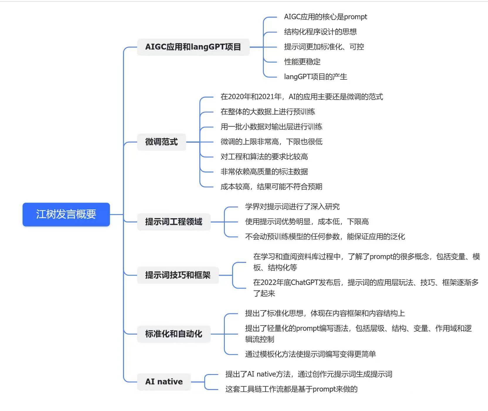

# Agents 的基石——提示词结构化方法论和实践

在《AI超级个体见面会，Al Agent 高端交流》——北京站 第一期  的发言内容分享。

## 发言稿正文

Hello, 大家好，我是云中江树，谢谢占总 (占冰强，微信bing3qiang) 为大家提供这么好的一个交流机会，很高兴今天能为带来提示词方面的分享。

今天的分享分为四个方面内容，自我介绍，提示词基础， LangGPT 结构化提示词，最后是一些实践和思考。

首先向大家自我介绍一下，我本名是刘远忠，云中江树是我的笔名。大家可以称呼我为江树，简单记忆——可以理解为江边的树。我本科毕业于电子科大，研究生毕业于武大， AI 相关专业硕士。今年毕业后，成为了一名自动驾驶算法工程师。我是一名科幻迷，曾经获得 2021年全国科普科幻之星荣誉。同时，我也是一个玩 AI 的爱好者。

我曾经探索过好几百个 AI 项目，整理成 ChatGPT 中文指南开源后，连续好几天登上了 GitHub 全球热榜。我发现这些项目的 **核心在于如何更好的调用大模型能力，即提示工程**，在观察学习了诸多提示词，尤其是 AutoGPT, 麋鹿先生这两个项目的提示词后，我形成了结构化提示词写作方法，在 5 月份将其开源为 LangGPT 项目，吸引了许多朋友的关注。

​	以此为契机，我认识了许多对 AI 抱有巨大热情的朋友，其中就包括 Broke 框架作者陈财猫。**为了能更好的专注于探索（AI）的无限可能，激发和支持更多的人创新创造，我和陈财猫联合创建了 EmbraceAGI 社区，欢迎大家关注支持！**

​

​	我21年就开始提示词工程的学习，为什么会研究提示工程呢？

​	作为一名 AI 算法工程师，22 年之前的许多 AI 应用都是使用的微调完成。**先预训练，然后用数据集微调模型的输出层，这是一种通用做法。实际微调多少层，多少参数等等都是可以变化的，甚至可以全参微调。微调有很多好处，缺点也很明显，依赖高质量标注数据，需要调试训练超参数，常常训练失败，甚至性能不如预训练模型。**

​

​	这时候 prompt tuning 出现了，**不用训练模型，只需要调整提示词即可，由于模型参数不会更新，所以能充分利用预训练模型的泛化性**，因此投入了学习。在阅读 prompt tuning 论文时候，同时也了解 prompt 的许多概念，如变量，模板，结构化等，为 LangGPT 提出打下了基础。

​

​	随后 ChatGPT 横空出世，各种提示词技巧、框架开始大爆发。

​

​	首先是各种提示词技巧，这里是我总结的一些现有的方法。一共 7 个，仅供参考，有不正确的地方欢迎批评指正。关于各种提示词方法，网上的资料也很齐全，在此不再赘述。

​	有一点值得说明的是，不应该盲目追求提示词技巧，要有自己的思考。尤其是各种学术论文里的提示词技巧，在应用层中实际使用时需要考虑是否合适。比如说前一阵子比较火的 “深呼吸方法” “take a deep breath”, 被炒作的比较厉害，实际上去阅读论文你可以发现，这个方法存在模型偏好，只针对谷歌的 PaLM 模型比较有效，在 GPT 上面表现一般。

**进行提示词写作时，以满足自己需求为第一要义，灵活选用技巧即可。**

​

随后出现了各种提示词框架，比如猫总的 BROKE 框架，对编写提示词有了更强的指导作用。猫总还写了提示词进阶这本书，受到了许多媒体的关注和报道，大家感兴趣可以买来看看，下面是猫总的微信，感兴趣可以添加好友交流。

​

再比如 CRISPE 框架，写出来的提示词大概是类似这样的一小段文本。

​

然而，**提示词的编写还是处于手工业阶段，依赖人去完成。想象一下未来 AGI 实现，agents 遍地的时候。我们必然要以工业的方式量产 agents，这也就意味着写 prompts 这件事情需要由手工业，变成现代的标准化、自动化流水线生产的事情。**

​

**那么怎么样以 AI native 的方式来做这件事情？**

​

考虑到当下的大模型几乎都是 Role-based 的模型。我想，既然人有自己的简历，我们也可以为 agents 定制一份简历。**Prompt 作为人操作机器的更高发展阶段的工具，可以借鉴结构化程序设计的方法，来设计结构化提示词，以实现提示词生产的标准化和专业化。**

**今年 4 月份成形，5 月初开源，LangGPT 的实践在世界范围来看都算是先行者。**

大家可以看到 LangGPT 写出来的 prompts 层次清晰，工整有序，和人的简历很像。如果你曾经见过类似这样的提示词，尤其是中文提示词，那么很大概率这个作者受到过结构化提示词思想的启发和影响。

​

怎么保证自动化生产的提示词的质量呢？答案是标准化。

首先是内容结构的标准化。整体采用基于角色的框架。为 agent 角色编写简历，它的名字，背景，介绍，技能，需要遵守的规则，工作流程，初始化行为等几个部分。

为规范各个部分的编写同时借鉴编程思想，设计了轻量的语法，包含变量，作用域，逻辑流控制等。通过复用 Markdown， json，yaml 等成熟格式直接实现。

为了进一步确保提示词质量，还设计了模板。模板层级结构清晰，可采用不同的格式。

**更重要的，封装了实践中最有效的提示词方法论确保质量。**

​

结构化方式促进了 markdown 格式提示词的流行，很多朋友**将结构化等同为 markdown 格式写作，这实际上是对我们的误解。**

Markdown 确实很好用，我们可以看到 OpenAI 的系统预置词也采用同样方式编写，也是 LangGPT 提示词采用的主要格式。但实际上**结构化 != 格式化，可采用任何格式，实践中类似 json，xml 这类具有闭合结构的语法甚至性能更加稳定。**

​

更重要的方面是方法论封装融合，LangGPT 进一步将技巧和框架融合，形成高质量的模板。

**封装的技巧包括角色扮演，CoT 思维链，格式法，属性词法，同时内置了提示词经典句，正是这些基础性的方法的封装，确保了生产的初版提示词的质量。**

LangGPT 的这种模板的思想，方法论封装的思想影响了一大批提示词编写者，国内许多公司都直接或间接的应用着 LangGPT 的这种结构化范式。

​

许多朋友应用了结构化提示词之后，提示词质量得到了很大提升，但不知道结构化提示词的本质是什么？

我这里借用一下刚哥的观点，**本质是方法论的封装。** 刚哥在结构化提示词方面也进行了很多创新创造，影响力很大，大家感兴趣可以关注，即刻 ID 为 李继刚。

​

解决了提示词标准化的问题，还有提示词生产自动化的问题。如何将纯手工的工作流转变为自动化的工作流？如何 AI Native 的完成这件事情？

我们的答案是提示词就可以做到。**提示词可以被视为 AI 时代的编程语言，因此我们设计了一套元提示词来进行结构化提示词的自动生成，这个事情在国内外我们也算是最早做的一批。**

依据我们的实践，自动生成的提示词可以节省 60% 的提示词编写时间，生成后的提示词性能不足时可通过人工调试迭代完善。

**在 LangGPT 社群的朋友还编写了许多提示词工具使得我们的工具链更加完善，如提示词分析优化，格式转换等等，在此感谢以刚哥，盘盘，文豪等朋友为代表的群友们的开源分享，感谢为社区付出巨大努力的志愿者们。**

​

AIGCLINK 也出过一期介绍 LangGPT 使用的视频，在此感谢占总的认可支持，欢迎大家关注 AIGCLINK 。

​

之后，得益于结构化提示词思想的广泛传播，方法论和结构更加完备。尤其是李继刚，刚哥，输出了超级多，超级棒的提示词，大家如果用过 arthur 写的提示词，那就是刚哥写的了。

同时，我们以开源共建共享的方式组建了提示词交流社群，为国内数千名提示词爱好者提供了一个开源开放的高质量交流平台，并构建了开放共享的提示词知识库，欢迎大家加入。

**在此需要感谢以梁思、若凡为代表的社区一大批志愿者，内容分享者和所有支持我们社群的朋友，没有大家的支持，我们不可能取得今天的成绩，感谢大家！**

​

最后，和大家分享一些提示词相关的思考。

​

时间有限，我们简单谈谈结构化提示词的局限性，有许多朋友对结构化提示词提出了很多有益的反思，这是很好的。结构化模板通过方法论封装能够保证提示词的质量，但有时候也会成为枷锁。提升自己提示工程能力这件事，就像读书一样，先把书读厚，再读薄，提示词也是如此，先写长，再写短。

人通过人的语言来操作AI ，操作机器，我认为是类似人类登上月球迈出的一步， 随着 AI 的进化，目前它还不完美，相信随着 AI 的进化，我们可以由人到神，对物质世界的控制做到言出法随，心随意动，我期待有生之年看到这一天的实现。

​

**我认为通用人工智能是实现这一愿景的现实基础。这是一个激动人心的时代，2016年我本科入学时，AlphaGo 击败李世石，在专用领域上已经无人能敌，2022 年我硕士毕业之际，ChatGPT 横空出世，在通用领域上取得了巨大的成功。只短短六年，AI 的发展令我们震撼，再过6 年，10 年，是否会换了人间？**

**OpenAI 实现 AGI，让 AGI 有益于全人类的愿景深深打动着我们，带着同样的愿景，我和财猫创建了 EmbraceAGI 开源社区，寓意拥抱 AGI 未来。我们希望专注于可持续和有意义的长期发展，欢迎志同道合的朋友加入我们，和我们一起玩 AI，探索 AI！欢迎大家支持我们！**

​

这是我们的联系方式，欢迎和我们多多交流，我今天的分享到此结束，谢谢大家！

## 后记

活动后收到很多不错的反响，现场的朋友夸我的分享很有激情，有朋友截图了每一页PPT，臻哥还整理出来了思维导图，很高兴有这样的分享机会，更高兴对大家有益有启发😊

臻哥整理的思维导图我觉得很好，与大家分享如下：

这是我在北京首次公开分享，很高兴能与这么多行业专家，技术大年共聚一堂，畅谈 AI，再次感谢占总（占冰强）为大家提供这么好的机会！

和大家分享一些现场照片，有类似机会欢迎大家带我一起玩 hh

