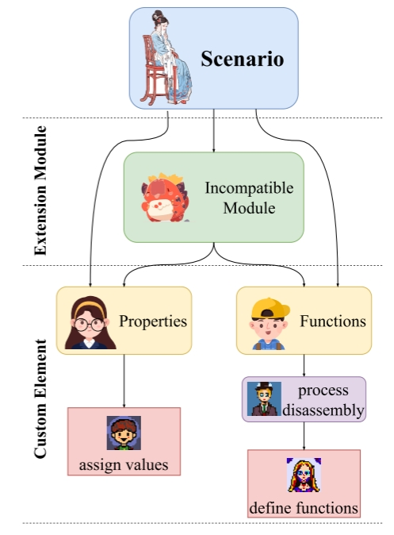
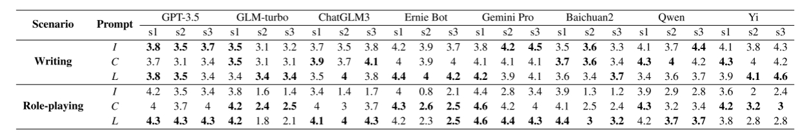

# LangGPT： 面向大语言模型的自然语言编程框架

> 大语言模型 (Large Language Models, LLMs) 在不同领域都表现出了优异的性能。然而，对于非AI专家来说，制定高质量的提示来引导 LLMs 是目前AI应用领域的一项重要挑战。现有的提示工程研究已经提出了一些零散的优化原则，也有些研究设计了基于经验的提示优化器。然而，这些研究缺乏结构化的设计模板，学习成本高，可复用性低。受到编程语言的结构化和可复用性的启发，我们提出了双层提示设计框架 LangGPT，作为面向 LLM 的编程语言。LangGPT 具有易于学习的规范结构，并为迁移和复用提供了扩展结构。实验表明，与 baseline 相比，LangGPT 极大地增强了 LLM 生成高质量回复的能力。此外，我们也证明了 LangGPT 框架能有效地指导 LLM 自动化地生成高质量提示。我们还基于 LangGPT 建立了一个社区，以促进提示设计的学习和共享。社区用户调查反馈表明了 LangGPT 的易用性和可复用性。

- 论文地址：[https://arxiv.org/abs/2402.16929](https://arxiv.org/abs/2402.16929)
- 项目地址：[https://github.com/EmbraceAGI/LangGPT](https://github.com/EmbraceAGI/LangGPT)
- 社区地址：[https://www.langgpt.ai/](https://www.langgpt.ai/)
- 作者：Ming Wang, Yuanzhong Liu, Xiaoming Zhang, Songlian Li, Yijie Huang, Chi Zhang, Daling Wang, Shi Feng, Jigang Li

## 1. 介绍

以 ChatGPT 为代表的大型语言模型(Large Language Models, LLMs)[Achiam 等人，2023；Schulman 等人，2023] 可以基于强大的语言理解能力、推理能力和生成能力执行各种各样的任务[Sun 等人，2023b；Sun 等人，2023c；Yu 等人，2023]。此外，注入领域知识还能让 LLM 执行与领域相关的特定任务 [Wang 等人，2023a；Li 等人，2023b；Zhang 等人，2023；Ren 等人，2023]。要充分发挥 LLM 的这些能力，就需要构造高质量的提示[Eric，2022；Chen 等人，2023；Gajula，2023]。因此，提示工程 (Prompt Engineering) 吸引了许多研究人员的关注[Varshney 和 Surla，2023；Mesk´o，2023；Wang，2023]。

提示工程是典型的经验科学，主要涉及提示设计和提示优化。由于 LLM 具备自然语言理解能力，可以通过非结构化的自然语言指令直接要求 LLM 执行任务。在此基础上，研究人员首先探索并总结出了一些优化提示的技巧。[Bsharat等人，2023年]介绍了26条指导原则，旨在让 LLMs 表现得更好。除了这些直接作用于提示的优化技巧外，一些研究人员还基于历史数据的提出了提示优化方法。[Sun 等人，2023a] 引导 LLM 从不正确的推理中得出特定实例的新提示，然后总结每个实例的对应提示，作为优化原始提示的参考。[Pryzant等人，2023年]定义了自然语言"梯度"，利用小批量数据求解该"梯度"并利用波束搜索和 Bandit 选择程序，按照梯度的相反语义方向编辑当前提示。[Fan 等人，2023 年]对一个大型提示数据库进行分析，并提出了一个自动提示优化框架。

基于历史数据的直接提示优化原则和方法需要丰富的经验。因此，这些方法通常只在特定任务或领域中表现良好。为了提高通用性，一些研究人员提出了自适应提示优化方法。[Guo 等人，2023 年] 将 LLM 与进化算法联系起来，提出了一种新的离散提示优化框架，称为 EvoPrompt。[Li等人，2023a]设计了一种多轮对话对齐策略，并利用GPT-4[Achiam等人，2023]生成易读的提示集。同时，他们还提出了一种高效的提示筛选指标，能以线性复杂度筛选出高质量的提示。[Wang等人，2023b]引入了PromptAgent，它可以反思模型错误并产生建设性的错误反馈，以诱导精确的专家级见解和深入的指导。[Hao等人，2022] 和 [Cheng等人，2023] 还从协调人类和 LLM 偏好风格的角度优化了提示。

提示优化可以大大提高 LLM 的性能，但由于缺乏系统性设计，高质量提示的可复用性很差。因此，一些研究人员设计了构建提示的规则。[Nigh, 2023]收集了大量高质量提示，并总结了用于提示设计的 CRISPE 规则。[ZamfirescuPereira等人，2023年]以基于LLM的聊天机器人设计工具原型为设计探针，支持非人工智能专家参与"终端用户提示工程"。此外，一些研究人员为不同领域的应用设计了提示构建规则。[Cao 等人，2023 年]为 ChatGPT 提出了各种利用深度学习执行程序修复任务的提示模板。[Yeh等人，2022年]将生物医学关系提取任务重新表述为简单提示表述下的 cloze 测试任务，从而系统地生成全面的提示语。[Liu和Chilton，2022年]在文生图任务的五个实验中评估了涵盖51个主题和51种风格的5493个生成提示，并总结了提示设计指南。

这些方法以AI专家大量的使用经验为基础，主要依赖列出的设计规则，缺乏系统性。此外，这些规则具有较强的领域相关性和模型相关性，但通用性、灵活性和可复用性较低。为了进一步释放 LLM 的性能，一些研究人员定义了 Agent。Agent 赋予 LLMs 使用工具、获取领域知识、保留长期或短期记忆以及制定计划的能力[Xu 等人，2023；Xi 等人，2023；Park 等人，2023]。虽然Agent [Chase，2022；Hong 等人，2023；Wu 等人，2023]系统地设计了提示的关键组件并预留了灵活的自定义接口，但学习成本非常高。此外，非 AI 专家很难修改 Agent 设计，可复用性较差。

为了推广基于 LLM 的应用，进一步激发 LLM 的潜力，我们希望设计一个高质量、可复用的提示模板。该模板应具有通用性和可扩展性。此外，该模板还应该易学易用。受 prompt 是 LLM 时代的编程语言这一观点的启发 [Alouani, 2023; Mund, 2023]，我们设计了一种面向 LLM 的编程语言，即一种 prompt 设计框架 **Lang**uage for **GPT**-like LLMs (LangGPT)。LangGPT 具有编程语言的系统性、规范性和可复用性的特点，并保留了自然语言的灵活性和可扩展性。我们首先分析了自然语言和编程语言之间的差异，以确定提示模板应具备的属性。LangGPT 设计为双层结构，由模块和内部元素组成。LangGPT 中的模块可分为两类：内置模块和扩展模块。对于内置模块，我们详细设计了每个模块的必要内部元素，并给出了示例模板。此外，对于扩展模块，我们统一了基本内部元素的设计。实验证明，在引导 LLM 方面，LangGPT 比基线提示更好。此外，LLM 可以利用这一框架自动生成提示，就像生成代码一样。

这项工作的主要贡献为：

- 我们提出了双层结构的提示设计框架 LangGPT，以提高提示的通用性和可复用性。我们还在 LangGPT 的基础上编写了详细的提示设计规则，从而降低了提示设计的学习成本，使 LLM 能够自动生成高质量的提示语。此外，我们提供了基于 LangGPT 的常见场景的通用提示模板，进一步简化了提示设计成本。
- 我们通过实验证明，基于 LangGPT 设计的提示可以更好地引导 LLM 执行任务。同时，我们举例说明了 LangGPT 可以帮助 LLM 生成高质量的提示。
- 我们建立了一个基于 LangGPT 的在线社区，提供使用文档和提示设计界面。此外，收集和分享优秀的提示案例也促进了 LLM 应用的交流。我们在社区中进行了用户体验调查，验证了 LangGPT 的易用性和可复用性。

## 2. 参考编程语言构造提示设计规则

与自然语言相比，编程语言更具标准化和可复用性。为了设计高质量的可复用的提示，我们分析了自然语言和编程语言之间的差异，并提出了提示设计原则。

### 2.1 自然语言与编程语言的区别

自然语言主要用于交流，而编程语言则是为机器执行任务定义的指令[GeeksforGeeks, 2023]。不同的应用目的导致这两种语言的创造和演变背景截然不同。

1. **目标受众**：自然语言是由人类对人类说的[Grune等人，2012]，而编程语言是由人类为机器准备的[Chakray，2018]。
2. **结构**：计算机只能理解固定的指令，这要求编程语言具有严格、严谨的语法和语义。相反，自然语言具有宽松而灵活的语法和语义，允许创造和变化，并具有高度的容错性。
3. **模糊性**：自然语言更加模棱两可，但人类有能力明确自然语言表达的意思。例如，顺序混乱和打字错误等问题对阅读的影响较小，发音错误也可以理解[Chakray，2018；Aho，2007]。编程语言比较准确，因为它们需要为计算机提供明确的指令[GeeksforGeek，2023]。
4. **演变与更新**：自然语言通过人类的使用和交流，随着时间的推移自然演变[Sipser，1996]。自然语言在增加新词与新的意义，以及摒弃过时用法方面是比较灵活的[Fromkin等人，2018年]。相反地，编程语言是专门为与机器通信而设计的[Sebesta，2012]，新的语法规则和功能需要明确的升级或正式发布[Pratt等人，1984]。

总而言之，这两种语言的主要区别在于，自然语言更模糊、更灵活，而编程语言更规范、更精确。LLM本质上执行大量计算，与机器有许多相似之处。因此，我们借鉴了编程语言的特点，结合自然语言的优势，提出了一种面向 LLM 的自然语言编程框架--LangGPT。

### 2.2 提示设计规则

我们参考编程语言的设计思想来优化提示。在分析了编程语言和自然语言的区别之后，我们提出了提示的设计原则：(1)**提示应具有规范化的格式**。灵活和模糊的自然语言对于LLM来说是很难理解的。格式规范的提示使用户的目的和要求更加突出。(2)**提示的结构应该是可扩展的**。自定义结构便于用户根据自己的领域和任务设计合适的提示。(3)**具体要求必须明确、完整**。指令和附加要求都应明确和完整，以避免误解或偏见。(4)**语言要灵活**。在需求明确的情况下，灵活的语言可以更好地适应不同的领域。此外，灵活的语言也便于用户学习。

## 3 面向大语言模型的自然语言编程框架

基于这些设计规则，我们提出了一种面向 LLM 的双层自然语言编程框架--LangGPT。

### 3.1 整体双层结构

为了系统地设计符合规则的提示，我们充分参考了面向对象编程语言的设计思想和结构[Rentsch，1982；Lutz，2010]。我们将提示视为一个软件项目，并将提示设计过程类比为软件开发过程。对应关系如图1所示。

图 1：编程语言和自然语言提示之间的类比。依据层次结构分析了两种语言之间的相似性。不同大小的圆圈表示不同的层。较小的圆圈表示更靠近内层，对应于较深的颜色。

通过类比分析可以发现，自然语言提示与编程语言具有相似的多层次结构。因此，我们参考编程语言的结构，提出了提示设计的双层结构，并定义了提示的模块和元素的概念。

一个完整的提示包含几个模块。模块类似于编程语言中的类，每个模块代表要求LLM的一个方面。例如，可以在Constraint、Goal、Profile等方面增加提示。在一个模块中，包括许多内部元素。元素类似于编程语言中的函数和属性，表示对LLM的直接和特定指令的内容。例如“输出不应超过500字”可以是提示中属于Constraint模块的元素。

双层结构可以很好地标准化提示的格式。然而，如果过于严格地要求提示遵循预定义的内置模块和基本元素，无法利用自然语言的灵活性的优势。此外，还会降低LangGPT对不同领域不同任务的通用性，不利于高质量提示的复用。为了解决这些问题，我们将模块和元素的类型进行了划分。我们首先定义了内置模块和基本元素作为预定义的双层提示模板。此外，我们还构建了支持自定义的扩展模块和自定义元素。我们为内置模块和扩展模块提供Markdown[Gruber，2012]和JSON[Pezoa等人，2016]格式。此外，我们为不同的模块编写了基本元素，并定义了编写自定义元素的规则。

### 3.2 内置模块的构造

该模块作为完整提示和指令单元之间的连接部分，对于控制提示的结构有非常重要的作用。

我们为几乎所有提示所需的关键方面定义了内置模块。此外，我们还针对与应用程序相关的某些场景定义了内置模块，以便于学习和使用。表1展示了我们为某些场景定义的内置模块。

在表1中，Prof. (Profile)指出了用户对LLM在角色方面的要求，包括个人简介、人物肖像等。Cons. (Constraint)表示约束或突出，即不允许LLM超出的范围以及生成回复时必须满足的要求等。Goal列出了用户想要实现的目标，这就是LLM需要完成的目标。Init. (Initialization)即初始化，以告知LLM即将开始对话。有时，该模块中还会给出指定的第一句话。Ex. (Example)给出了输入-输出对作为供LLM学习的例子。Wkflo. (Workflow)指示了执行任务时的工作流程，类似于 CoT 方法 [Wei 等人., 2023]。当任务需求比较复杂时，往往需要实例化这个模块。Skill用于向LLM表明他们拥有的技能。经过工具学习的LLM，可以指导他们调用工具，更准确地执行任务。另外，我们计划在未来的工作中提供使用该模块下工具的能力，参考代理工具的设计[Chase, 2022;洪等人，2023]。Sug. (Suggestion)包括对LLM的建议和行为规划。该模块重点列出常见场景，并告诉LLM在此类情况下可以采取的行为或应对措施。Bkgrd. (Background)表示LLM在执行任务时需要具备的背景信息和记忆。Style限定了LLM生成回复的风格。Outf. (Output Format)定义了LLM的输出格式。指定输出格式可以提高某些任务中结果提取的效率和准确性。

表 1：内置模块定义的状态。该表列出了我们目前定义的8类应用场景以及为这些场景定义的模块。 ✓表示已经针对该场景设计了相应的模块。相反， ✗ 表示没有设计。

## 3.3 内部基本元素

提示通常包含三个目的：(1)向LLM传递某种信息； (2)让LLM执行某个有输出或无输出的任务； (3)前两者的结合。

第一个与编程语言中属性或变量的定义非常相似。相应地，后两类类似于编程语言中的函数。因此，我们构建了这三种类型的基本元素。我们使用“⟨PROPERTY⟩ 是⟨VALUE⟩”语句来模拟赋值操作。对于后两种情况，需要指定输入信息、任务和输出，其中输入和输出可以省略。我们使用“对于给定的⟨VALUE⟩的⟨PROPERTY⟩，请执行以下操作：⟨ACTIONS⟩；返回⟨RESULT⟩。”的形式来模拟函数。在我们提供的基本元素模式中，**尖括号**中包含的内容需要根据模块和使用场景来填充。需要注意的是，我们提供的模式仅指定了编辑内部元素的想法。为了提高提示的通用性和灵活性，可以调整语言来表达关键信息。在表 2 中，我们展示了一些模块中基本元素的一些示例。

表2：写作场景中内置模块的基本内部元素示例。该提示属于写作场景，其目的是为给定的文章生成标题。我们选择了五个模块作为示例——Profile、Goal、Constraint、Workflow和Style——并展示了每个模块的一个内部元素。特别是，对于Workflow模块，我们展示了一个类似函数的基本元素。

### 3.4  扩展模块和自定义元素

我们定义的内置模块已经尽可能全面地涵盖了提示的许多方面。此外，我们还添加了LangGPT涵盖的应用场景和模块。但受限于我们自身的能力和领域知识，我们无法考虑LLM的所有应用场景。

因此，除了内置模块和基本元素之外，我们还定义了扩展模块和自定义元素，以提高提示的通用性和复用性。扩展模块和自定义元素的设计流程如图2所示。

这个过程可以帮助用户快速分析他们的需求并提出提示中需要包含的要点。基于LangGPT提供的设计模板以及设计流程，可以优化高质量提示以快速匹配应用场景。

图 2：扩展模块和自定义元素的设计流程。对于内置模块无法覆盖所有方面的应用场景，可以根据需要定义新的扩展模块。定义了扩展模块后，还应该根据扩展模块的要求来设计内部元素。另外，如果内置模块能够满足应用场景需求，但基本元素无法满足所有需求，可以直接在内置模块中添加自定义元素。需要注意的是，扩展模块和内置模块应尽可能相互排斥，以最大限度地减少修改成本。

## 4 实验

为了验证我们提出的LangGPT的先进性，我们在两个方面进行了实验：LLM执行任务的效果和LangGPT的可用性调研。在我们的实验中，我们选择了两种类型的应用场景：写作和角色扮演。对于每个场景，我们选择了五个由社区用户构建和共享的具体的任务助手。

### 4.1 Baseline

为了进行比较，我们选择了两个baseline。

- **直接指令**：提示仅包含对LLM提出的说明以及所需的必要信息。
- **CRISPE**：提示设计规则 [Night，2023]。该框架从宏观角度前瞻性地定义了提示的组成部分。它需要一个完整的提示，包含Capacity和Role、Insight、Statement、Personality和Experiment。

直接指令提示非常直观，可最大限度地节省token。但这种方式内容太少，往往不能全面传达需求，也难以抓住重点。 CRISPE提供了一个相对完整的设计框架，而不是一些零散的规则。但它没有清晰的结构化设计，不利于学习和高质量提示的复用。另外，CRISPE对提示中包含的元素有严格的规范，泛化能力较低。

由于这些方法在提示设计上的缺点，我们设计了LangGPT。然而，除了这些直观的优势之外，我们还需要验证提示能否引导LLM执行任务，这才是提示设计最本质的目的。

### 4.2 大语言模型

我们选择了表 3 中所示的这些LLM进行评估，实验中的所有任务均于2024年1月18日前完成。

表 3：实验中使用的LLM。“unk”表示我们不知道这些模型的规模。

### 4.3 评估指标

由于任务场景的复杂性，缺乏客观的评价指标。因此，我们使用人工评估和LLM评估来评估LLM执行任务的能力。为了更好地保证评估的合理性，我们针对两种场景设定了评估标准。

对于写作任务，我们要求评估者从3个维度评估LLM执行任务的有效性：文本连贯性、格式规范和内容丰富度。生成主题连贯的内容的能力很重要。然而，我们发现LLM在生成任务中通常能够保持主题一致性，因此没有针对这方面设计评估指标。对于角色扮演任务，我们同样设计了3个维度的评价指标：语言风格、角色相关性和主题一致性。

对于每个评估指标，我们定义了从0到5的分数来表示不同的级别，并解释了每个整数分数对应的情况的描述。此外，我们允许评估者在不同级别之间打 .5 分。

该评估框架还可以指导高性能LLM，例如GPT-4和Ernie Bot-4，自动评估其表现。由于LLM作为评估者的一致性较低[Liu et al., 2023]，实验中也发现LLM评分的区分度很低，因此我们仅采用了人工评估的结果。

### 4.4 结果

提示引导LLM执行任务能力最直观的体现是LLM在执行提示引导的任务时的表现。因此，我们评估了LLM在两种情况下的表现，结果如表 4 及表 5 所示。

表 4：引导LLM执行任务的不同提示的结果。粗体字体表示在当前场景中效果最佳的提示类型。 I、C、L 分别表示三种提示符，即Instruction-only、CRISPE、LangGPT。 s1到s3分别代表两种场景的三个评估指标。对于写作场景来说，s1是文本连贯性，s2是格式规范，s3是内容丰富度。对于角色扮演场景，s1是语言风格，s2是角色相关性，s3是主题一致性。

从结果可以看出，LangGPT更擅长引导LLM执行任务。此外，我们还注意到一个有趣的现象。某些具有特别严格安全限制的LLM将拒绝回答，例如关于吹牛和暴躁等话题的问题或请求。 LangGPT可以让这些LLM认识到这只是一种说话方式，而**不是真正具有破坏性的行为**，并引导LLM生成回复。其他两个baseline都无法做到这一点。

为了评估 LangGPT 的易用性，我们在在线社区进行了一项用户调查。该社区已经运行了六个多月，已经聚集了来自各行各业的数千名用户，包括制造、建筑、信息技术、金融和娱乐。因此，调查结果的客观性能够得到保证。我们设计了一份关于 LangGPT 体验的完整调查问卷，以确保答案的质量。调查问卷包括关于易用性的评分问题。用户评分结果如图3所示。从图3可以看出，87.81%的用户给出了3分或更高的分数，这表明用户对LangGPT的易用性表示认可。此外，LangGPT在用户调查中的总体满意度得分为8.48分(满分10分)。

图 3：用户调查中的易用性评分。最低分是0分，表示非常难用，最高分是5分，表示非常容易使用。 “：”用于分隔分数和百分比。

表 5：不同LLM在两种情况下的平均得分。

## 4.5  案例研究

为了更直观地展示LangGPT的效果，我们从实验中筛选了具体案例。除了直接的效果比较之外，我们还尝试使用LangGPT来指导LLM生成质量提示。

### 提示引导LLM

在我们的实验中，我们使用三种提示来引导LLM扮演马屁精，图 4 中给出了一个示例。

在此示例中，直接指令提示和 CRISPE 提示引导的 ChatGPT 都只是回复用户的话语。相比之下，LangGPT 引导的 ChatGPT 在针对用户给定主题进行了更加夸张的吹嘘。此外，它从更广泛的角度表达赞美，也更有个性。

### LangGPT引导LLM编写提示

在实验中，我们还尝试让LLM使用 LangGPT 构建提示。图 5 展示了一个示例。

图 4：马屁精的案例。 ChatGPT-3.5 在三种不同提示下对用户的回复。需要注意的是，明远大学是虚构的。

图 5：ChatGPT-3.5 使用 LangGPT 生成提示的示例。为了便于演示，一些模块被省略。

如果直接要求LLM生成有关 MBTI 评估的提示，他们可能会拒绝。然而，LangGPT 可以指导LLM生成无害的高质量提示。

## 5 结论

在本文中，我们提出了 LangGPT，一个用于提示设计的结构化且可扩展的框架。 LangGPT具有类似于面向对象编程语言的系统结构，易于学习和复用。实验表明，LangGPT 在指导LLM执行任务方面比baseline方法表现更好。我们还在LangGPT构建的社区中进行了用户调查，以验证LangGPT的易用性和可复用性。在未来的工作中，我们将进一步优化LangGPT的设计，减少LangGPTtoken消耗。此外，我们还将添加对LLM使用第三方工具和自定义工具的支持。

## 伦理声明

在LLM的应用过程中，可能会出现伦理争议，但LangGPT的设计及本文的写作过程避免了可能出现的伦理问题。
