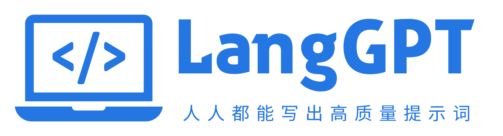

# 🚀 LangGPT — Empowering Everyone to Create High-Quality Prompts!

<div align="center">


[](/LICENSE)
[]()
[](https://arxiv.org/abs/2402.16929)
[](https://github.com/langgptai/LangGPT)

[English](README.md) | [简体中文](README_zh.md) | [日本語](README_ja.md)

[Quick Start](#-quick-start) | [Theoretical Foundations](#-theoretical-foundations) | [Ecosystem](#-langgpt-ecosystem) | [Community](http://feishu.langgpt.ai)

</div>

---

## 📖 What is LangGPT?

**LangGPT is a structured, reusable prompt design framework** that enables anyone to create high-quality prompts for Large Language Models. Think of it as a **"programming language for prompts"** — systematic, template-based, and infinitely scalable.

### Why LangGPT?

Traditional prompt engineering relies on scattered tips and trial-and-error. LangGPT transforms this chaos into a structured methodology:

- 🎯 **Structured Templates** — Hierarchical organization inspired by programming paradigms
- 🔄 **Reusability** — Create once, adapt infinitely like code modules  
- 📦 **Modularity** — Variables, commands, and conditional logic at your fingertips
- ⚡ **Efficiency** — Go from idea to working prompt in minutes
- 🌍 **Community-Driven** — 11,000+ stars, battle-tested by thousands of users

> **Academic Foundation**: Published research at [arXiv:2402.16929](https://arxiv.org/abs/2402.16929) | [中文版](Papers/LangGPT_paper_cn.md)

---

## 🚀 Quick Start

### Method 1: Use Automated Tools (Fastest)

Let AI create prompts for you:

- **[LangGPT GPTs](https://chat.openai.com/g/g-Apzuylaqk-langgpt)** — Full-featured generator (GPT-4)
- **[Kimi+ LangGPT](https://kimi.moonshot.cn/kimiplus/conpg00t7lagbbsfqkq0)** — For Moonshot Kimi users
- **[PromptGPT](https://chat.openai.com/g/g-YKe3gmydD-promptgpt)** — Lite version (GPT-3.5)

### Method 2: Master the Template (5 Minutes)

Basic LangGPT structure:

```markdown
# Role: Your_Role_Name

## Profile
- Author: YourName
- Version: 1.0
- Language: English
- Description: Clear role description and core capabilities

## Goal
- Outcome: What concrete result/outcome should be delivered for the user/session
- Done Criteria: Clear acceptance criteria (how we know it’s finished and good)
- Non-Goals: What is explicitly out of scope to avoid scope creep

### Skill-1
1. Specific skill description
2. Expected behavior and output

## Rules
1. Don't break character under any circumstance
2. Don't make up facts or hallucinate

## Workflow
1. Analyze user input and identify intent
2. Apply relevant skills systematically
3. Deliver structured, actionable output

## Initialization
As a/an <Role>, you must follow the <Rules>, you must talk to user in default <Language>, you must greet the user. Then introduce yourself and introduce the <Workflow>.
```

**Prerequisites**: Basic Markdown knowledge ([Quick Guide](https://docs.github.com/en/get-started/writing-on-github/getting-started-with-writing-and-formatting-on-github/basic-writing-and-formatting-syntax)) | GPT-4 or Claude recommended

### Method 3: Start from Examples

Explore our [example library](https://langgptai.feishu.cn/wiki/RXdbwRyASiShtDky381ciwFEnpe) and adapt proven templates to your needs.

### Method 4: Claude Code Skill (Recommended)

If you use [Claude Code](https://docs.anthropic.com/en/docs/claude-code), install the LangGPT Skill to get structured prompt writing capabilities:

**Install via the official marketplace (recommended):**

```bash
/plugin marketplace add langgptai/claude_marketplace
/plugin install structured-prompt-writer@langgpt
```

The [LangGPT marketplace](https://github.com/langgptai/claude_marketplace) also ships more battle-tested skills by Yunzhong Jiangshu — `awesome-design-html` (115 brand-themed design references), `cto`, and `mind-clone`.

**Or install manually:**

1. Download [langgpt.skill](https://github.com/langgptai/LangGPT/releases)
2. Extract to `~/.claude/skills/` directory
3. Type `/langgpt` in Claude Code to use

**Skill Features:**
- 📝 Structured prompt templates (Role, Profile, Skills, Rules, Workflow)
- 📚 Rich example library (FitnessGPT, Poet, Xiaohongshu Master, Name Master, etc.)
- 🔧 Advanced techniques: variables, commands, conditional logic
- 🎯 Model compatibility guide (GPT-4, Claude, GPT-3.5)

---

## 🧠 Theoretical Foundations

Before diving into tactics, understand the principles. These essays explore the philosophy behind effective prompting:

- **[对话动力学](Docs/对话动力学.md)** — The dynamics of human-AI dialogue
- **[五种理性](Docs/五种理性.md)** — Five types of rationality in prompt design
- **[镜像性倾向](Docs/镜像性倾向.md)** — Mirror tendencies in LLM behavior
- **[统计重力井和边缘表达](Docs/统计重力井和边缘表达.md)** — Statistical gravity well and edge expression
- **[关系表达](Docs/关系表达.md)** — Expressing relationships in prompts
- **[看见与言说](Docs/看见与言说.md)** — Seeing and articulation in AI interaction  
- **[Prompt 的本质](Docs/Prompt的本质.md)** — The essence and nature of prompts
- **[面向结果的提示词写作方法](Docs/面向结果的提示词写作方法.md)** — Writing prompts that focus on achieving desired outcomes
- **[AI意识](Docs/AI意识.md)** — Understanding the role of AI in human-AI interaction
- **[AI时代的新管理：机器负责优化，人类定义应该](Docs/AI时代的新管理：机器负责优化，人类定义应该.md)** — The new management in the AI era: machines optimize, humans define the criteria
- **[AI Native 组织 · 思考碎片](Docs/AI%20Native组织-思考碎片.md)** — Fragments on organizational restructuring in the AI-native era

*These foundational insights will transform how you think about prompts.*

---

## 💡 Core Concepts

### 1. Structured Roles

Define AI personas through clear, modular sections:

| Section | Purpose | Example |
|---------|---------|---------|
| **Role** | Role name/title | "逻辑学家" / "Expert Analyst" / "FitnessGPT" |
| **Profile** | Identity and capabilities | "Expert Python developer with 10 years experience" |
| **Goal**           | Desired outcome, done criteria, and non-goals for this session/task | “Refactor a prompt into a reusable template; acceptance criteria: pass three structured checks; non-goal: rewriting the business logic.”                    |
| **Skills** | Specific abilities | "Debug complex code, optimize performance" |
| **Rules** | Boundaries and constraints | "Never execute destructive commands" |
| **Workflow** | Interaction logic | "1. Analyze → 2. Plan → 3. Execute" |
| **Initialization** | Opening message and setup | "As a <Role>, I will greet you and introduce the <Workflow>" |

### 2. Variables and References

Use `<Variable>` syntax for dynamic content:

```markdown
As a <Role>, you must follow <Rules> and communicate in <Language>
```

This creates self-referential prompts that maintain consistency across complex instructions.

### 3. Commands

Define reusable actions for better UX:

```markdown
## Commands
- Prefix: "/"
- Commands:
    - help: Display all available commands
    - continue: Resume interrupted output
    - improve: Enhance current response with deeper analysis
```

### 4. Conditional Logic

Add intelligence to your prompts:

```markdown
If user provides [code], then analyze and suggest improvements
Else if user asks [question], then provide detailed explanation
Else, prompt for clarification
```

### 5. Advanced Techniques

**Reminders** — Combat context loss in long conversations:
```markdown
## Reminder
1. Always check role settings before responding
2. Current language: <Language>, Active rules: <Rules>
```

**Alternative Formats** — Use JSON/YAML when markdown isn't ideal:
```yaml
role: DataAnalyst
profile:
  version: "2.0"
  language: "Python"
skills:
  - statistical_analysis
  - data_visualization
```

---

## 🌟 Featured Examples

| Prompt | Description | Link |
|--------|-------------|------|
| 🎯 **FitnessGPT** | Personalized diet and workout planner | [View](examples/FitnessGPT.md) |
| 💻 **Code Master CAN** | Advanced coding assistant with debugging expertise | [View](examples/code_anything_now/ChatGPT-Code_Anything_Now_en.md) |
| ✍️ **Xiaohongshu Writer** | Viral social media content generator | [View](examples/chinese_xiaohongshu_writer/) |
| 🎨 **Chinese Poet** | Classical poetry composer in traditional styles | [View](examples/chinese_poet/) |

[Browse 100+ more examples →](https://langgptai.feishu.cn/wiki/RXdbwRyASiShtDky381ciwFEnpe)

---

## 📚 Learning Resources

### Essential Guides

| Resource | Description | Date |
|----------|-------------|------|
| [Academic Paper](https://arxiv.org/abs/2402.16929) | LangGPT: Rethinking Structured Reusable Prompt Design ([中文](Papers/LangGPT_paper_cn.md)) | Feb 2024 |
| [Structured Prompts Guide](Docs/HowToWritestructuredPrompts.md) | Comprehensive tutorial on building high-performance prompts | Jul 2023 |
| [Prompt Chains](Docs/PromptChain.md) | Multi-prompt collaboration and task decomposition strategies | Aug 2023 |
| [Video Tutorial](https://www.bilibili.com/video/BV1rj411q78a) | BiliBili walkthrough (by AIGCLINK) | Sep 2023 |

### Advanced Topics

- **[推理模型提示方法变革](https://mp.weixin.qq.com/s/FLY0sy1jYv6eT9151Yz_jw)** — Paradigm shift from procedural to goal-oriented prompting
- **[提示词的道和术](https://langgptai.feishu.cn/wiki/AYMWwBPaSih46WkAo9jcfKkfntg)** — Philosophy and practice of prompt engineering by 李继刚
- **[企业级提示词工程](https://langgptai.feishu.cn/wiki/UTyswvusTiRw0TkZLI5cIG0Tnhc)** — Building production-ready prompt systems (百川智能)
- **[多模态提示词](https://mp.weixin.qq.com/s/Aan9NXO_vEZ9h0YrugpoGQ)** — GPT-4V and multi-modal prompting techniques
- **[提示词攻击与防护](https://mp.weixin.qq.com/s/aaABXnxRqDF716qRk79wYQ)** — Security: prompt injection, jailbreaks, and defenses
- **[大模型绘画指南](https://mp.weixin.qq.com/s/bJbZ9bwPXxlpyREqLKhDvA)** — AI image generation with structured prompts

### Community Hub

**[Feishu Knowledge Base](http://feishu.langgpt.ai)** — Curated resources, templates, and community contributions

---

## 🎨 LangGPT Ecosystem

### Core Framework & Tools

| Project | Description | Stars |
|---------|-------------|-------|
| **[LangGPT](https://github.com/langgptai/LangGPT)** | Core framework and methodology |  |
| **[PromptVer](https://github.com/langgptai/PromptVer)** | Semantic versioning for prompts — version control like Git |  |
| **[PromptShow](https://github.com/langgptai/PromptShow)** | Create beautiful prompt images ([Try it](https://show.langgpt.ai/)) |  |
| **[Minstrel](https://github.com/langgptai/Minstrel)** | Multi-agent system for auto-generating prompts |  |
| **[claude_marketplace](https://github.com/langgptai/claude_marketplace)** | Official Claude Code skill marketplace — structured prompt, design, CTO, mind-clone |  |

### Model-Specific Prompt Collections

Rather than writing prompts as procedures, write the persona. Writing prompts as procedures gives the model steps and tools. Writing prompts as a persona gives the model a worldview, motivations, a value system, and a preference profile. Below are prompts that Yunzhong Jiangshu wrote while studying some well-known figures. 

* [巴菲特AI分身](Prompts/巴菲特AI分身.md)
* [梵高AI分身](Prompts/梵高AI分身.md)
* [马斯克AI分身](Prompts/马斯克AI分身.md)
* [段永平AI分身](Prompts/段永平AI分身.md)

Curated, optimized prompts for different AI models:

| Collection | Target Model | Stars |
|------------|--------------|-------|
| [wonderful-prompts](https://github.com/langgptai/wonderful-prompts) | ChatGPT (Chinese) |  |
| [awesome-claude-prompts](https://github.com/langgptai/awesome-claude-prompts) | Anthropic Claude |  |
| [awesome-deepseek-prompts](https://github.com/langgptai/awesome-deepseek-prompts) | DeepSeek & R1 |  |
| [awesome-gemini-prompts](https://github.com/langgptai/awesome-gemini-prompts) | Google Gemini |  |
| [awesome-grok-prompts](https://github.com/langgptai/awesome-grok-prompts) | xAI Grok |  |
| [qwen-prompts](https://github.com/langgptai/qwen-prompts) | Alibaba Qwen |  |
| [awesome-llama-prompts](https://github.com/langgptai/awesome-llama-prompts) | Meta Llama 2/3 |  |
| [awesome-doubao-prompts](https://github.com/langgptai/awesome-doubao-prompts) | ByteDance Doubao |  |
| [awesome-system-prompts](https://github.com/langgptai/awesome-system-prompts) | System prompts from AI tools |  |

### Specialized Domains

| Repository | Focus Area | Stars |
|------------|------------|-------|
| [Awesome-Multimodal-Prompts](https://github.com/langgptai/Awesome-Multimodal-Prompts) | GPT-4V, DALL-E 3, image/video prompts |  |
| [deep-research-prompts](https://github.com/langgptai/deep-research-prompts) | Deep research across models |  |
| [awesome-voice-prompts](https://github.com/langgptai/awesome-voice-prompts) | Voice AI and conversational agents |  |
| [GraphRAG-Prompts](https://github.com/langgptai/GraphRAG-Prompts) | Graph-based retrieval prompts |  |
| [LLM-Jailbreaks](https://github.com/langgptai/LLM-Jailbreaks) | Security research and defenses |  |

### Applications

| Project | Description | Stars |
|---------|-------------|-------|
| [BookAI](https://github.com/langgptai/BookAI) | AI-powered book generation |  |
| [AI-Resume](https://github.com/langgptai/AI-Resume) | Beautiful resumes with Claude Artifacts |  |

---

## 🛠️ Popular GPTs Built with LangGPT

Transform ChatGPT with these specialized assistants:

| GPT | Purpose | Link |
|-----|---------|------|
| 🎯 **LangGPT Expert** | Auto-generate structured prompts | [Launch](https://chat.openai.com/g/g-Apzuylaqk-langgpt) |
| ✍️ **PromptGPT** | Professional prompt engineer | [Launch](https://chat.openai.com/g/g-YKe3gmydD-promptgpt) |
| 🧠 **SmartGPT-5** | Never lazy, always diligent assistant | [Launch](https://chat.openai.com/g/g-sRQtxpN4C-smartgpt-5) |
| 💻 **Coding Expert** | Comprehensive programming assistant | [Launch](https://chat.openai.com/g/g-ky06YjwaP-coding-expert) |
| 📊 **Data Table GPT** | Transform messy data into clean tables | [Launch](https://chat.openai.com/g/g-nb6RjxHsb-data-table-gpt) |
| 🔥 **PytorchGPT** | PyTorch code specialist | [Launch](https://chat.openai.com/g/g-kyj3zKyHK-pytorchgpt) |
| 🎨 **LogoGPT** | Professional logo designer | [Launch](https://chat.openai.com/g/g-wdz2JlUBv-logogpt) |
| 📄 **PDF Reader** | Deep document analysis and extraction | [Launch](https://chat.openai.com/g/g-YaMjCVW0t-pdf-reader) |
| 🏅 **MathGPT** | Precise mathematical problem solver | [Launch](https://chat.openai.com/g/g-UIOlPhTjK-mathgpt) |
| 📝 **WriteGPT** | Professional writing across industries | [Launch](https://chat.openai.com/g/g-jwTMtRiL8-writegpt) |
| 🎙️ **时事热评员** | Current events commentator | [Launch](https://chat.openai.com/g/g-gbfs6fy7c-shi-shi-re-ping-yuan) |
| 🎀 **翻译大小姐** | Elegant Chinese translations | [Launch](https://chat.openai.com/g/g-2V90YGvVD-fan-yi-da-xiao-jie) |

[Discover 20+ more GPTs →](https://github.com/langgptai/LangGPT#langgpt-gpts)

---

## 🤝 Contributing

We welcome all contributions to make LangGPT better!

### How You Can Help

1. ⭐ **Star and share** — Increase visibility and help others discover LangGPT
2. 📝 **Submit examples** — Share your successful prompts built with LangGPT
3. 🆕 **Propose templates** — Create new templates beyond the Role structure
4. 📖 **Improve docs** — Fix typos, clarify instructions, add translations
5. 💡 **Suggest features** — Open issues with ideas for new capabilities
6. 🔧 **Code contributions** — Help build tools, utilities, and integrations

### Getting Started

New to GitHub contributions? Check out this [GitHub Minimal Contribution Guide](https://github.com/datawhalechina/DOPMC/blob/main/GITHUB.md)

---

## 📊 Star History

[](https://star-history.com/#langgptai/LangGPT&Date)

---

## 📄 Citation

If you use LangGPT in research or projects, please cite:

```bibtex
@misc{wang2024langgpt,
      title={LangGPT: Rethinking Structured Reusable Prompt Design Framework for LLMs from the Programming Language}, 
      author={Ming Wang and Yuanzhong Liu and Xiaoming Zhang and Songlian Li and Yijie Huang and Chi Zhang and Daling Wang and Shi Feng and Jigang Li},
      year={2024},
      eprint={2402.16929},
      archivePrefix={arXiv},
      primaryClass={cs.SE}
}
```

---

## 🙏 Acknowledgments

LangGPT was inspired by excellent projects:

- [Mr.-Ranedeer-AI-Tutor](https://github.com/JushBJJ/Mr.-Ranedeer-AI-Tutor) — Structured tutoring prompts
- [Auto-GPT](https://github.com/Significant-Gravitas/Auto-GPT) — Autonomous AI agents
- [SoM](https://github.com/SkalskiP/SoM) — Set of Mark prompting
- [yolov10](https://github.com/THU-MIG/yolov10) — Computer vision innovations

### Projects Built with LangGPT

We're proud to see LangGPT principles applied in the wild:
- **[Prompt Optimizer](https://github.com/linshenkx/prompt-optimizer)** — Intelligent prompt optimization tool leveraging LangGPT methodology
- **[securityGPT](https://github.com/rryuliu/securityGPT)** — Secure prompt protection against leaks
- **[AIPainting-Structured-Prompts](https://github.com/zhutyler21/AIPainting-Structured-Prompts)** — Structured prompts for AI art generation

---

## 📬 Connect With Us

### Author

**云中江树 (Yun Zhong Jiang Shu)**
- 📱 WeChat Official Account: **「云中江树」**
- 💼 Creator of LangGPT Framework
- 🎓 Prompt Engineering Researcher

### Community

- 📚 [Knowledge Base](http://feishu.langgpt.ai) — Comprehensive documentation
- 🐦 [Twitter/X](https://twitter.com/langgptai) — Latest updates
- 💬 [GitHub Discussions](https://github.com/langgptai) — Community forum
- 📧 Email: contact@langgpt.ai

---

<div align="center">

**[⬆ Back to Top](#-langgpt--empowering-everyone-to-create-high-quality-prompts)**

Made with ❤️ by the [langgptai Community](https://github.com/langgptai)

*Empowering everyone to become a prompt expert* 🚀

</div>